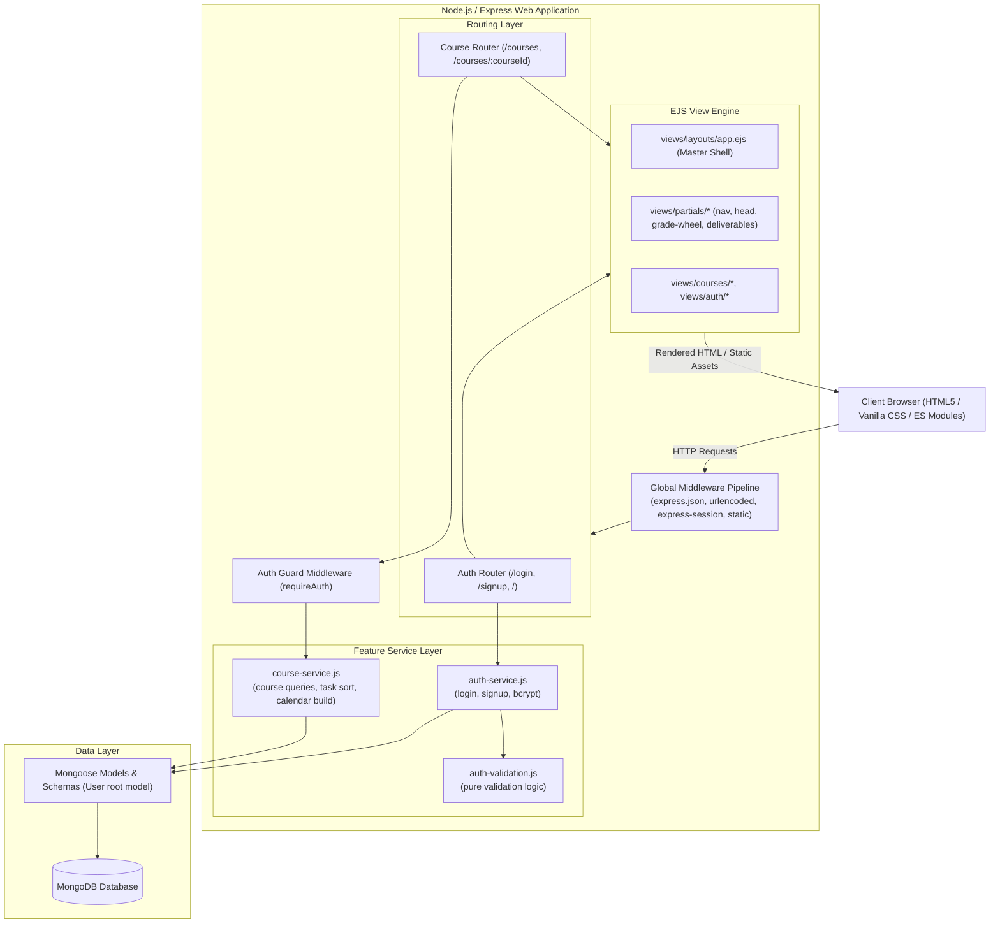
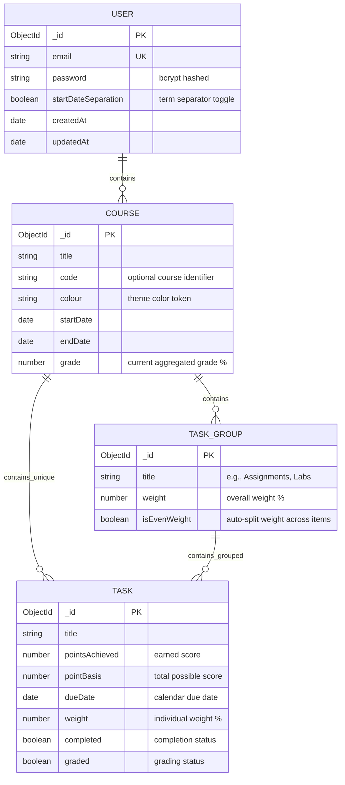
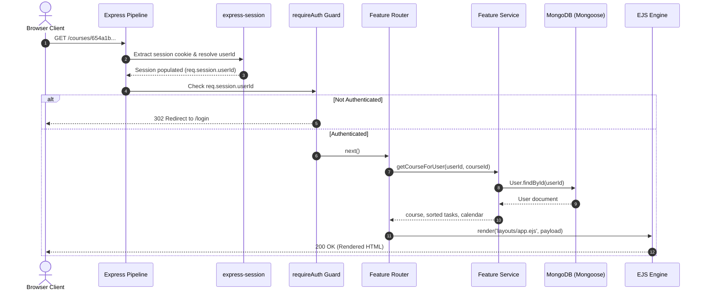

# Architecture Documentation — GradeStar

This document describes the software architecture, system design, data modeling, component hierarchy, and runtime behaviors of **GradeStar**.

---

## 1. High-Level Architecture Overview

GradeStar is structured as a **monolithic server-side rendered (SSR) web application** built on Node.js, Express, EJS, and MongoDB with Mongoose ODM. It combines traditional server-rendered templates for rapid page loads and simple session state management with targeted client-side Vanilla JavaScript micro-interactions (e.g., real-time password criteria, inline popup dialogs, responsive sidebar states).

### System Topology



---

## 2. Data Modeling & Schema Hierarchy

GradeStar adopts a **User-Centric Embedded Document Pattern**. In this design, a student's entire academic profile—including courses, assignment groupings, and deliverables—is encapsulated within that student's [User](file:///Users/anthonyfuca/Desktop/Programming/GradeStar/src/models/user-model.js) document.

### Entity Relationship Diagram



### Schema Definitions

1. **User Schema ([src/models/user-model.js](file:///Users/anthonyfuca/Desktop/Programming/GradeStar/src/models/user-model.js))**:
   - `email`: Trimmed, lowercased, unique string with format validation.
   - `password`: Hashed with bcrypt (10 salt rounds).
   - `courses`: Array of embedded [courseSchema](file:///Users/anthonyfuca/Desktop/Programming/GradeStar/src/models/course-schema.js) subdocuments.
   - `startDateSeparation`: Boolean flag indicating whether the user prefers dashboard courses split by start date/term.
   - `timestamps`: Automatic `createdAt` and `updatedAt` tracking.

2. **Course Subdocument Schema ([src/models/course-schema.js](file:///Users/anthonyfuca/Desktop/Programming/GradeStar/src/models/course-schema.js))**:
   - `title`: Name of the course (e.g., "Linear Algebra 2").
   - `code`: Optional catalog code (e.g., "MATH235").
   - `colour`: Accent color identifier for card badges and UI theming.
   - `startDate`: Beginning of the academic period.
   - `endDate`: End of the academic period (optional).
   - `grade`: Calculated or cached course percentage (0 to 100).
   - `taskGroups`: Array of embedded [taskGroupSchema](file:///Users/anthonyfuca/Desktop/Programming/GradeStar/src/models/task-group-schema.js) items.
   - `uniqueTasks`: Array of standalone [taskSchema](file:///Users/anthonyfuca/Desktop/Programming/GradeStar/src/models/task-schema.js) items (e.g., Midterms, Finals) that exist outside weighted groups.

3. **TaskGroup Subdocument Schema ([src/models/task-group-schema.js](file:///Users/anthonyfuca/Desktop/Programming/GradeStar/src/models/task-group-schema.js))**:
   - `title`: Group category (e.g., "Quizzes", "Assignments", "Mobius Labs").
   - `weight`: Aggregated syllabus percentage weight (e.g., 20%).
   - `isEvenWeight`: When `true`, each task in the group inherits an equal share of the group weight ($\text{task weight} = \text{group weight} / N$).
   - `tasks`: Array of embedded [taskSchema](file:///Users/anthonyfuca/Desktop/Programming/GradeStar/src/models/task-schema.js) items.

4. **Task Subdocument Schema ([src/models/task-schema.js](file:///Users/anthonyfuca/Desktop/Programming/GradeStar/src/models/task-schema.js))**:
   - `title`: Deliverable title (e.g., "Assignment 1", "Midterm Exam").
   - `pointsAchieved`: Student's score (default: 0).
   - `pointBasis`: Maximum points possible (default: 100).
   - `dueDate`: Optional timestamp for calendar mapping.
   - `weight`: Absolute percentage contribution toward the final course grade.
   - `completed`: Boolean indicating student completion.
   - `graded`: Boolean indicating whether the deliverable has received a score.

### Architectural Rationale: Embedded Subdocuments vs. Normalized References

- **Atomic Writes**: A student's entire course configuration can be updated or retrieved in a single document read/write without multi-collection joins (`$lookup`).
- **Complete Tenancy Isolation**: Data cannot accidentally leak across users because courses have no standalone identity outside their parent User record.
- **Cascading Deletions**: Deleting a user or course automatically cleans up all associated sub-deliverables without orphan records.
- **Document Size Guardrails**: Academic history for a single student (typically 40–60 courses with 10–20 tasks each) consumes less than 500 KB, safely within MongoDB's 16 MB BSON document size limit.

---

## 3. Core Application Subsystems

### A. Authentication & Session Security Subsystem

- **Session Store**: Managed by [express-session](file:///Users/anthonyfuca/Desktop/Programming/GradeStar/src/app.js#L18-L22) configured with a cryptographic session secret (`process.env.SESSION_SECRET`).
- **Session Cookie**: Stores the signed session ID in an HTTP cookie (`connect.sid`). The server-side session stores `userId`.
- **Route Guarding**: Protected routes pass through the [requireAuth](file:///Users/anthonyfuca/Desktop/Programming/GradeStar/src/middleware/require-auth.js) middleware. Unauthenticated requests are immediately redirected to `/login`.
- **Password Security**:
  - Validated by pure functions in [auth-validation.js](file:///Users/anthonyfuca/Desktop/Programming/GradeStar/src/features/auth/auth-validation.js):
    - Length: between 6 and 28 characters inclusive.
    - Uppercase letter requirement (`[A-Z]`).
    - Lowercase letter requirement (`[a-z]`).
    - Number or special character requirement (`[0-9!@#$%^&*(),.?":{}|<>]`).
  - Passwords are encrypted using `bcrypt.hash(password, 10)` before persistence and compared using `bcrypt.compare` during login.

### B. Course Management & Synthesis Subsystem

The courses domain ([src/features/courses/](file:///Users/anthonyfuca/Desktop/Programming/GradeStar/src/features/courses/)) isolates course handling from HTTP routing:

1. **Dashboard Synthesis (`getCoursesForUser`)**:
   Fetches user document and returns the `courses` subdocument array to populate [views/courses/courses.ejs](file:///Users/anthonyfuca/Desktop/Programming/GradeStar/views/courses/courses.ejs).
2. **Individual Course View (`getCourseForUser`)**:
   Locates a specific course via Mongoose's subdocument ID finder: `user.courses.id(courseId)`. Returns 404 if the ID is malformed or not found in the authenticated user's records.
3. **Task Flattening & Weight Sorting (`listCourseTasks`)**:
   Combines tasks from all `taskGroups` with standalone `uniqueTasks` into a unified list, sorted in descending order of grade weight.
4. **Course Creation (`createCourse`)**:
   Validates required title and code, generates a new course with default values (purple accent, current date, 0% initial grade), saves the parent User document, and returns the newly generated subdocument `_id`.

### C. Visual Grade Wheel Component

The grade wheel ([views/partials/grade-wheel.ejs](file:///Users/anthonyfuca/Desktop/Programming/GradeStar/views/partials/grade-wheel.ejs)) provides a dynamic SVG circular percentage progress indicator without external charting dependencies.

- **Geometry**: The circle SVG path uses a radius of $r = 15.9155$, producing a circumference of:
  $$C = 2 \pi r \approx 2 \times 3.14159 \times 15.9155 \approx 100$$
- **Stroke Dash Offset Calculation**: Because the circumference is normalized to 100, `stroke-dasharray="percentage, 100"` precisely renders the corresponding percentage arc.
- **Corner Clamping**: The partial applies slight calibration adjustments at high percentages (e.g. $\ge 98\% \to \text{pct} - 3$) to prevent SVG stroke-cap overlap artifacts at the apex of the circle.

### D. Server-Rendered Calendar Subsystem

Rather than relying on heavy client-side calendar libraries (like FullCalendar), GradeStar builds calendar grids server-side in [course-service.js](file:///Users/anthonyfuca/Desktop/Programming/GradeStar/src/features/courses/course-service.js#L79-L110):

1. **Due Date Aggregation**: Traverses all course tasks and aggregates valid `dueDate` objects.
2. **Grid Geometry**: Computes the first weekday of the month (0 = Sunday to 6 = Saturday) and fills leading blank slots with `null`.
3. **Cell Classification**: Emits an array of day cell objects marked with boolean flags:
   - `isToday`: Day matches the current date.
   - `hasDue`: One or more deliverables fall on this date.
4. **View Rendering**: Rendered inside [views/courses/course.ejs](file:///Users/anthonyfuca/Desktop/Programming/GradeStar/views/courses/course.ejs) as a CSS grid with weekday headers.

---

## 4. Master Layout & View Architecture

GradeStar utilizes a unified master template shell: [views/layouts/app.ejs](file:///Users/anthonyfuca/Desktop/Programming/GradeStar/views/layouts/app.ejs).

```text
┌────────────────────────────────────────────────────────┐
│ views/layouts/app.ejs                                  │
│  ├── <%- include('../partials/head.ejs') %>            │
│  │    ├── Charset & viewport meta                      │
│  │    ├── Google Font 'Outfit'                         │
│  │    └── Dynamic <link rel="stylesheet"> injection    │
│  ├── <body>                                            │
│  │    ├── <% if (showNav) { %>                         │
│  │    │     <%- include('../partials/nav.ejs') %>      │
│  │    │   <% } %>                                      │
│  │    ├── <%- include(contentPartial) %>               │
│  │    │     ├── views/auth/login.ejs                   │
│  │    │     ├── views/auth/signup.ejs                  │
│  │    │     ├── views/courses/courses.ejs              │
│  │    │     └── views/courses/course.ejs               │
│  │    └── Dynamic <script type="module"> injection     │
│  └─────────────────────────────────────────────────────┘
```

### Style Cascade Strategy

Styles are strictly segregated to avoid style leakage and maintain fast load times:
1. `public/styles/shared/general.css`: Base reset, font definitions, form styling, button primitives, utility classes.
2. `public/styles/shared/nav.css`: Sidebar layout, responsive breakpoints, Lucide icon sizing.
3. `public/styles/shared/content.css`: Standard main content containers, page headers, search bars, action buttons.
4. `public/styles/shared/popup.css`: Modal overlay backdrops, animations, card containers.
5. `public/styles/<feature>/*.css`: Scoped page-level styles (e.g. `courses.css`, `course-card.css`, `course.css`, `auth.css`).

---

## 5. Request-Response Pipeline

The Express server initializes middleware in strict order within [src/app.js](file:///Users/anthonyfuca/Desktop/Programming/GradeStar/src/app.js):



---

## 6. Security & Operational Considerations

- **Session Invalidation**: Passwords should never be returned in API or view payloads; user queries exclude passwords whenever possible.
- **SQL / NoSQL Injection Prevention**: Mongoose schemas enforce strong typing on all fields. Dynamic object queries are not accepted directly from unvalidated request bodies.
- **Error Sanitization**: [src/middleware/error-handler.js](file:///Users/anthonyfuca/Desktop/Programming/GradeStar/src/middleware/error-handler.js) logs technical error stack traces to server stdout/stderr while rendering a clean, sanitized error page (`views/errors/500.ejs`) to users.
- **Database Connection Resilience**: Database initialization in [src/config/database.js](file:///Users/anthonyfuca/Desktop/Programming/GradeStar/src/config/database.js) catches connection exceptions and cleanly halts the process (`process.exit(1)`), preventing the server from listening in an unbacked state.
